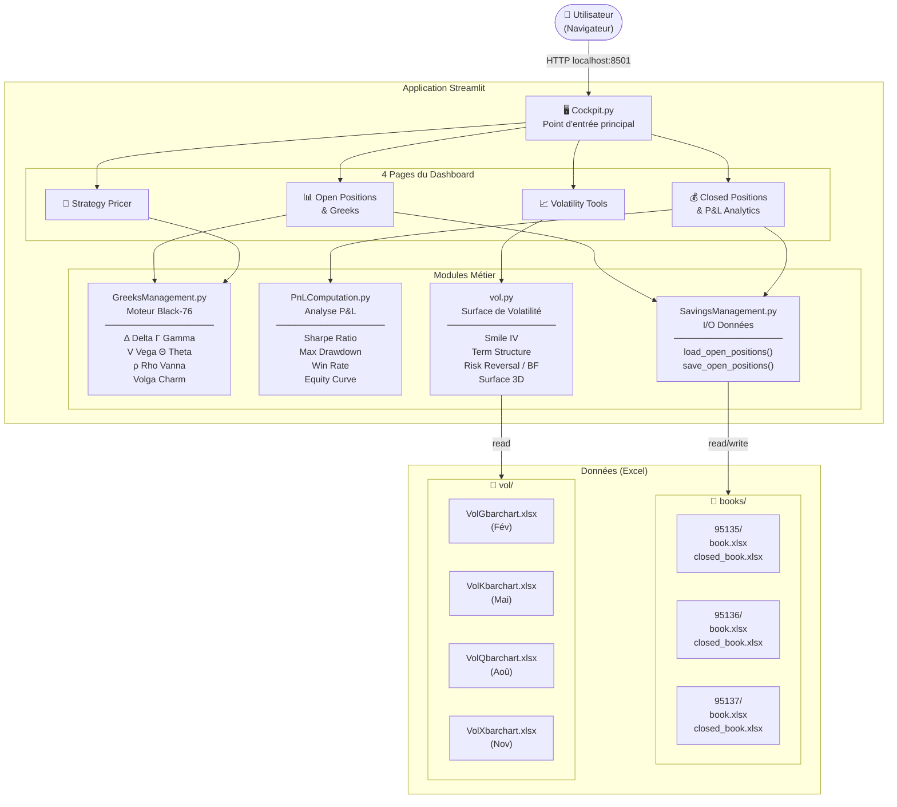
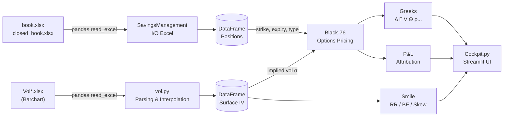
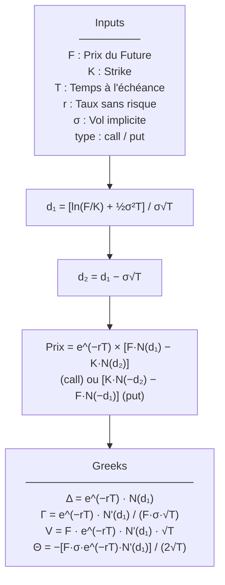
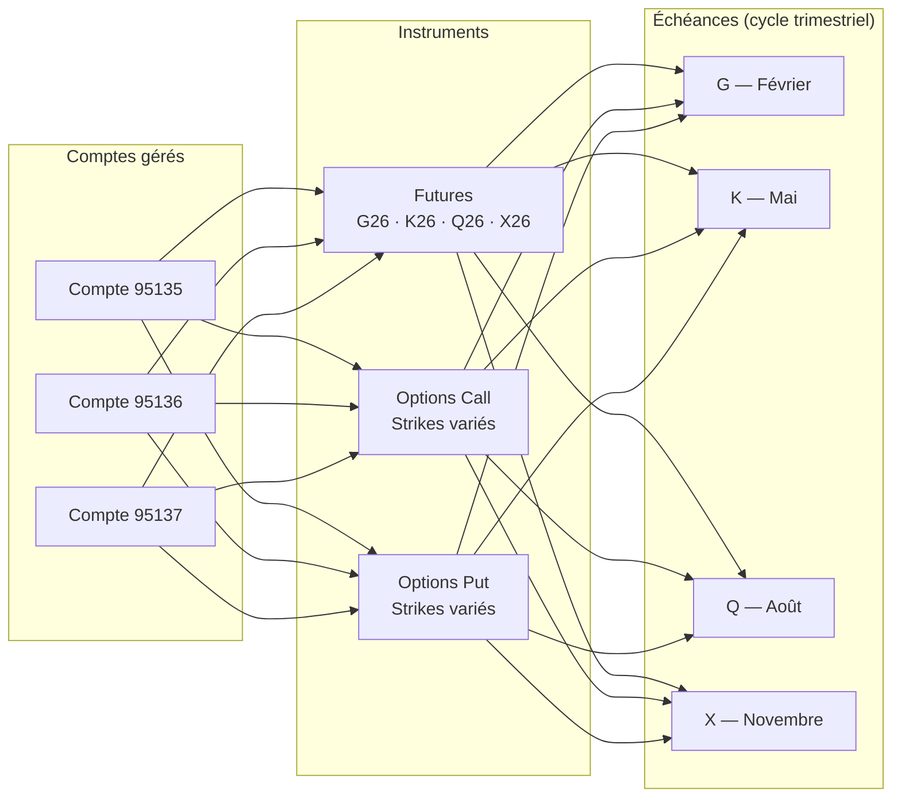

# Architecture — PricerLB

## Vue d'ensemble

```mermaid
graph TB
    User(["👤 Utilisateur\n(Navigateur)"])

    subgraph App["Application Streamlit"]
        direction TB
        Cockpit["🖥️ Cockpit.py\nPoint d'entrée principal"]

        subgraph Pages["4 Pages du Dashboard"]
            P1["📊 Open Positions\n& Greeks"]
            P2["💰 Closed Positions\n& P&L Analytics"]
            P3["📈 Volatility Tools"]
            P4["🧮 Strategy Pricer"]
        end

        subgraph Modules["Modules Métier"]
            GM["GreeksManagement.py\nMoteur Black-76\n─────────────────\nΔ Delta  Γ Gamma\nV Vega   Θ Theta\nρ Rho    Vanna\nVolga    Charm"]
            PL["PnLComputation.py\nAnalyse P&L\n─────────────────\nSharpe Ratio\nMax Drawdown\nWin Rate\nEquity Curve"]
            VOL["vol.py\nSurface de Volatilité\n─────────────────\nSmile IV\nTerm Structure\nRisk Reversal / BF\nSurface 3D"]
            SM["SavingsManagement.py\nI/O Données\n─────────────────\nload_open_positions()\nsave_open_positions()"]
        end
    end

    subgraph Data["Données (Excel)"]
        direction LR
        subgraph Books["📁 books/"]
            B1["95135/\nbook.xlsx\nclosed_book.xlsx"]
            B2["95136/\nbook.xlsx\nclosed_book.xlsx"]
            B3["95137/\nbook.xlsx\nclosed_book.xlsx"]
        end
        subgraph VolData["📁 vol/"]
            V1["VolGbarchart.xlsx\n(Fév)"]
            V2["VolKbarchart.xlsx\n(Mai)"]
            V3["VolQbarchart.xlsx\n(Aoû)"]
            V4["VolXbarchart.xlsx\n(Nov)"]
        end
    end

    User -->|"HTTP localhost:8501"| Cockpit
    Cockpit --> P1 & P2 & P3 & P4

    P1 --> GM
    P1 --> SM
    P2 --> PL
    P2 --> SM
    P3 --> VOL
    P4 --> GM

    SM -->|"read/write"| Books
    VOL -->|"read"| VolData
```

---

## Flux de données

```mermaid
flowchart LR
    XLS_POS["book.xlsx\nclosed_book.xlsx"]
    XLS_VOL["Vol*.xlsx\n(Barchart)"]

    IO["SavingsManagement\nI/O Excel"]
    PARSE_VOL["vol.py\nParsing & Interpolation"]

    DF_POS[("DataFrame\nPositions")]
    DF_VOL[("DataFrame\nSurface IV")]

    BLACK76["Black-76\nOptions Pricing"]
    GREEKS["Greeks\nΔ Γ V Θ ρ..."]
    PNL["P&L\nAttribution"]
    SMILE["Smile\nRR / BF / Skew"]

    UI["Cockpit.py\nStreamlit UI"]

    XLS_POS -->|"pandas read_excel"| IO --> DF_POS
    XLS_VOL -->|"pandas read_excel"| PARSE_VOL --> DF_VOL

    DF_POS -->|"strike, expiry, type"| BLACK76
    DF_VOL -->|"implied vol σ"| BLACK76

    BLACK76 --> GREEKS
    BLACK76 --> PNL
    DF_VOL --> SMILE

    GREEKS --> UI
    PNL --> UI
    SMILE --> UI
```

---

## Modèle de pricing — Black-76

```mermaid
flowchart TD
    IN["Inputs\n────────\nF  : Prix du Future\nK  : Strike\nT  : Temps à l'échéance\nr  : Taux sans risque\nσ  : Vol implicite\ntype : call / put"]

    D1["d₁ = [ln(F/K) + ½σ²T] / σ√T"]
    D2["d₂ = d₁ − σ√T"]

    PRICE["Prix = e^(−rT) × [F·N(d₁) − K·N(d₂)]\n(call) ou [K·N(−d₂) − F·N(−d₁)] (put)"]

    GREEKS["Greeks\n──────────────────────\nΔ = e^(−rT) · N(d₁)\nΓ = e^(−rT) · N'(d₁) / (F·σ·√T)\nV = F · e^(−rT) · N'(d₁) · √T\nΘ = −[F·σ·e^(−rT)·N'(d₁)] / (2√T)"]

    IN --> D1 --> D2 --> PRICE --> GREEKS
```

---

## Structure des comptes

```mermaid
graph LR
    subgraph Accounts["Comptes gérés"]
        A1["Compte 95135"]
        A2["Compte 95136"]
        A3["Compte 95137"]
    end

    subgraph Instruments["Instruments"]
        FUT["Futures\nG26 · K26 · Q26 · X26"]
        CALL["Options Call\nStrikes variés"]
        PUT["Options Put\nStrikes variés"]
    end

    subgraph Expiries["Échéances (cycle trimestriel)"]
        G["G — Février"]
        K["K — Mai"]
        Q["Q — Août"]
        X["X — Novembre"]
    end

    A1 & A2 & A3 --> FUT & CALL & PUT
    FUT & CALL & PUT --> G & K & Q & X
```
